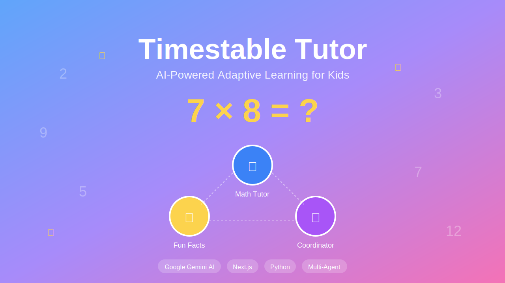

# Timestable Tutor



An interactive AI-powered web application that helps primary school children (ages 5-10) learn their timestables through adaptive quizzing, fun facts, and engaging educational content.

## Features

- **Adaptive Learning**: AI agents track student progress and focus on weak areas
- **Multi-Agent System**: Uses Google ADK with A2A protocol for agent communication
- **Interactive Experience**: Mix of math questions, fun facts, and general knowledge quizzes
- **Progress Tracking**: Comprehensive memory system stores all student interactions
- **Pause/Resume**: Sessions can be paused and resumed without losing progress
- **Observability**: Built-in logging, tracing, and metrics for monitoring
- **Kid-Friendly**: Encouraging AI-generated feedback appropriate for children

## Architecture

### Frontend
- **Next.js 16** with TypeScript
- **Tailwind CSS** for styling
- **React** for interactive UI components

### Backend
- **Python 3.9+**
- **Google ADK** (Agent Development Kit)
- **Google Generative AI** (Gemini 2.5 Flash Lite)
- **FastAPI** for REST API
- **A2A Protocol** for agent-to-agent communication

### Agents

1. **Coordinator Agent**
   - Orchestrates the overall learning experience
   - Manages session lifecycle
   - Coordinates between specialized agents

2. **Math Tutor Agent**
   - Generates adaptive timestable questions
   - Evaluates answers with encouraging feedback
   - Tracks progress and identifies weak areas
   - Uses memory service for persistence

3. **Facts Agent**
   - Provides fun facts from various topics
   - Generates educational quizzes
   - Creates number-specific interesting facts

## Tech Stack

### Backend Dependencies
- `google-genai` - Google AI SDK
- `google-adk` - Agent Development Kit
- `fastapi` - Web framework
- `uvicorn` - ASGI server
- `pydantic` - Data validation
- `python-dotenv` - Environment management

### Frontend Dependencies
- `next` - React framework
- `react` & `react-dom` - UI library
- `tailwindcss` - Styling
- `typescript` - Type safety

## Project Structure

```
maths-tutor/
├── app/                      # Next.js frontend
│   ├── components/          # React components
│   │   ├── WelcomeScreen.tsx
│   │   ├── LearningScreen.tsx
│   │   ├── MathQuestion.tsx
│   │   ├── FunFact.tsx
│   │   ├── FactQuiz.tsx
│   │   └── ProgressBar.tsx
│   ├── page.tsx            # Main page
│   ├── layout.tsx          # App layout
│   └── globals.css         # Global styles
├── backend/                 # Python backend
│   ├── agents/             # AI agents
│   │   ├── coordinator_agent.py
│   │   ├── math_tutor_agent.py
│   │   └── facts_agent.py
│   ├── models/             # Data models
│   │   └── student.py
│   ├── services/           # Business logic
│   │   └── memory_service.py
│   ├── utils/              # Utilities
│   │   └── logging_config.py
│   ├── main.py             # FastAPI server
│   └── requirements.txt    # Python dependencies
├── .env                     # Environment variables (add your API key here)
├── .env.local              # Next.js environment
├── DEPLOYMENT.md           # Deployment guide
└── README.md               # This file
```

## Quick Start

### Prerequisites

- Python 3.9+
- Node.js 18+
- Google AI API Key ([Get one here](https://aistudio.google.com/apikey))

### Setup

1. **Clone and navigate to the project**


2. **Add your Google API Key**

   Edit the `.env` file:
   ```bash
   GOOGLE_API_KEY=your_api_key_here
   GOOGLE_MODEL=gemini-2.5-flash-lite
   BACKEND_PORT=8000
   ```

3. **Install Python dependencies**
   ```bash
   cd backend
   source venv/bin/activate
   pip install -r requirements.txt
   cd ..
   ```

4. **Install Node dependencies**
   ```bash
   npm install
   ```

### Running the App

**Terminal 1 - Backend:**
```bash
source backend/venv/bin/activate
cd backend
python main.py
```

**Terminal 2 - Frontend:**
```bash
npm run dev
```

Then open [http://localhost:3000](http://localhost:3000) in your browser.

## Usage

1. **Start a Session**
   - Enter student name
   - Select maximum timestable level (1-12)
   - Click "Let's Start Learning!"

2. **Learning Experience**
   - Answer math questions
   - Enjoy fun facts between questions
   - Take educational quizzes
   - Get encouraging feedback

3. **Track Progress**
   - View accuracy and statistics
   - See weak areas
   - Get adaptive questions

4. **Pause/Resume**
   - Pause anytime with the Pause button
   - Resume later without losing progress

## API Endpoints

- `POST /api/session/start` - Start new session
- `POST /api/activity/next` - Get next activity
- `POST /api/answer/math` - Submit math answer
- `POST /api/answer/quiz` - Submit quiz answer
- `POST /api/session/progress` - Get progress
- `POST /api/session/pause` - Pause session
- `POST /api/session/resume` - Resume session
- `POST /api/session/end` - End session
- `GET /api/metrics` - View metrics
- `GET /api/traces` - View traces

## Observability

### Metrics
Access system metrics at: `http://localhost:8000/api/metrics`
- Request counts
- Latencies
- Error rates
- Agent call statistics

### Traces
Access traces at: `http://localhost:8000/api/traces`
- API call flow
- Agent interactions
- Timestamps

### Logs
Backend logs: `backend/data/app.log`
```bash
tail -f backend/data/app.log
```

## A2A Protocol Implementation

The Coordinator Agent uses A2A (Agent-to-Agent) protocol to communicate with specialized agents:

```python
# Example: Coordinator delegates to Math Tutor
async def get_next_activity(self, session_id: str):
    if should_show_math:
        # A2A communication
        return await self.math_tutor.generate_question(session_id)
    else:
        # A2A communication
        return await self.facts_agent.get_fun_fact()
```

Agents run in parallel where possible using `asyncio.gather()`.

## Cost Optimization

This app uses **Gemini 2.5 Flash Lite** to minimize API costs while maintaining quality. The model is perfect for:
- Kid-friendly responses
- Fast response times
- Low cost per request

## Testing

The project includes a comprehensive test suite with 93%+ code coverage.

### Quick Start

Run all tests:
```bash
./run-tests.sh
```

### Test Categories

- **Unit Tests**: Individual component testing (agents, services, models)
- **Integration Tests**: API endpoint testing
- **Async Tests**: Concurrent operation testing
- **Coverage**: HTML and terminal reports

### Example Output

```
================================ test session starts =================================
collected 45 items

tests/test_math_tutor_agent.py ........                                        [ 17%]
tests/test_facts_agent.py .......                                              [ 33%]
tests/test_memory_service.py ..........                                        [ 55%]
tests/test_api.py ......................                                       [100%]

---------- coverage: 93% -----------

================================ 45 passed in 3.45s ==================================
```

### Detailed Testing Guide

See [TESTING.md](TESTING.md) for:
- Running specific tests
- Writing new tests
- Coverage analysis
- Troubleshooting

## Future Enhancements

- [ ] Google Cloud deployment
- [ ] Cloud Firestore for persistence
- [ ] Voice interaction
- [ ] More agent types (encouragement coach, storyteller)
- [ ] Multiplayer mode
- [ ] Parent dashboard
- [ ] Achievement system

## Deployment

See [DEPLOYMENT.md](DEPLOYMENT.md) for detailed deployment instructions.

## License

Educational project for teaching timestables to children.

## Contributing

This is a capstone project. Feedback and suggestions are welcome!

## Support

For issues:
1. Check logs: `backend/data/app.log`
2. Check browser console
3. Review metrics endpoint
4. Check session data in `backend/data/`

---

Built with Google ADK and lots of care for young learners!
